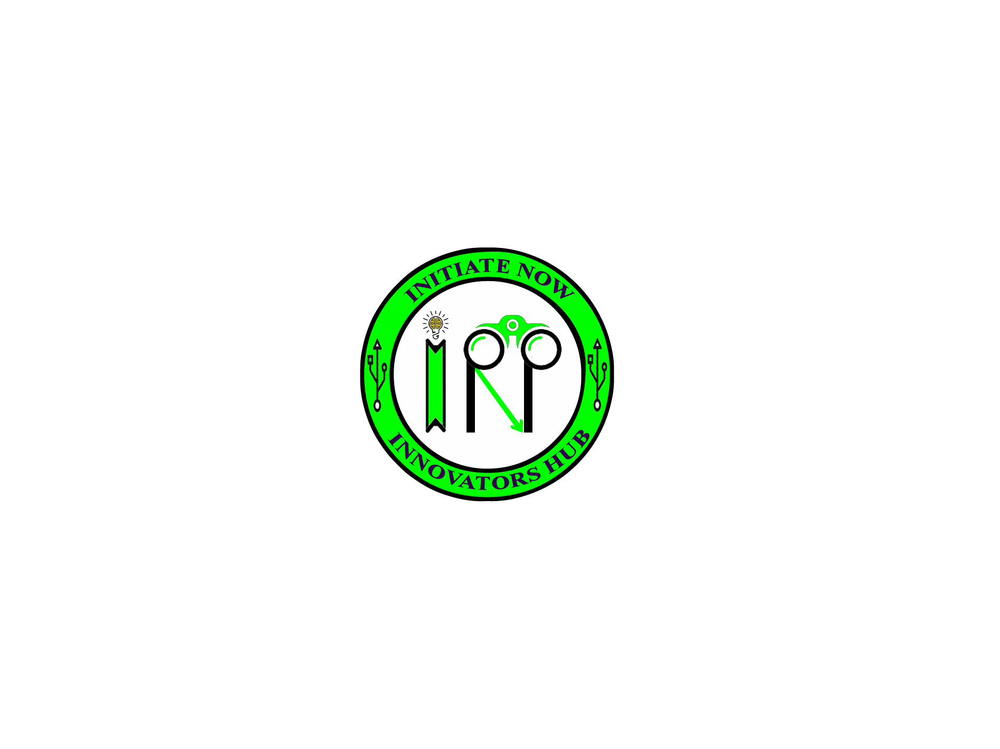

<table align="center">
  <tr>
    <td></td>
    <td>
      <h1 style="font-size: 2.5em;">Initiate Now's GitHub Profile</h1>
    </td>
  </tr>
</table>

---

👋 **Hi there!**  
I'm **Navin**, an **Embedded Software Developer** with over **4 years** of experience in building efficient, reliable, and high-performance software solutions for embedded systems. I specialize in **microcontrollers**, **driver development**, **hardware-software integration**, and **automated testing**.

---

## 🚀 **Technologies & Tools I Work With**

### 🛠️ **Languages**
- **Programming**: C, Embedded C, Python  
- **Scripting**: Batch, Groovy  

### 🖥️ **Platforms**
- **Operating Systems**: Windows & Linux  
- **Microcontrollers**: ESP32, PIC16F877A, STM32, NRF5x  
- **Wireless Protocols**: BLE, Wi-Fi  

### 🔗 **Communication Protocols**
- SPI, I2C, I2S, UART, SCI, PDM, ADC, PWM  

### 📟 **Development Boards**
- Raspberry Pi, Arduino  

### 🔧 **Sensors & Modules**
- **Sensors**: MLX90614, MLX90632, BNO055, ADXL345, Bosch Sensors, SHT20  
- **Modules**: Load Cell (HX711, ADS1231), Max86141 with Max32664, RRC Battery, OLED Display  

### 🛠️ **SDKs & Frameworks**
- nrf5 SDK, NRF Connect SDK, Zephyr, ESP-IDF  

### 💻 **IDEs & Tools**
- **IDEs**: MPLABX, Arduino IDE, VSCode, STM32Cube, Keil, PyCharm, Anaconda  
- **Compilers**: XC8, ARM GNU Toolchain  
- **Unit Testing Tools**: gtest, pytest  
- **Collaboration**: Jira, Bitbucket, GitHub, SourceTree  
- **CI/CD**: Jenkins, Git  

### 🧩 **Embedded Design**
- Baremetal Programming, Driver Development, Unit Testing, Integration Testing, Automation Testing  

---

## 📊 **GitHub Stats**

  
  

---

## 🌟 **Let's Connect!**

- **LinkedIn**: [Navin Chakravarthy K](https://www.linkedin.com/in/navin-chakravarthy-k-5b7385123)  
- **Instagram**: [@initiate_now](https://instagram.com/initiate_now?r=nametag)  
- **Facebook**: [@Initiate_Now](https://facebook.com/Initiate_Now-105016194644939)  
- **YouTube**: [@initiatenow](https://www.youtube.com/@initiatenow9361)  

---

🚀 **Feel free to reach out** if you have questions, ideas, or want to collaborate on something exciting! 😊  
