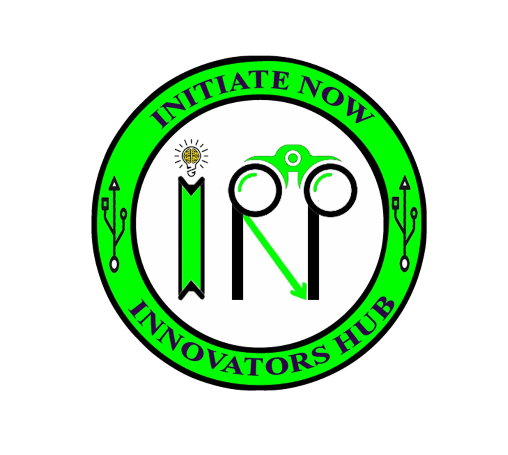

<table align="center">
  <tr>
    <td></td>
    <td>
      <h1 style="font-size: 5.5em;">Initiate Now</h1>
    </td>
  </tr>
</table>

---

# Hi 👋, I'm K. Navin Chakravarthy

### Embedded Software Engineer | Firmware Developer

Passionate about Embedded Systems, Firmware Development, RTOS, and Embedded Linux. Currently strengthening my skills in driver development, system design, and real-world embedded applications.

---
## 🚀 About Me

- 💻 Embedded Software Engineer
- 🌱 Currently learning STM32, FreeRTOS, and Linux Device Drivers
- 🔧 Interested in Embedded C, Firmware Architecture, and Debugging
- 📚 Preparing for Embedded Systems and Firmware Development roles
- 🎯 Goal: Become a highly skilled Firmware Engineer

---
## 🛠️ Technical Skills

### Programming
- C
- Basic C++
- Python
- Shell Scripting

### Embedded Systems
- Embedded C
- PIC16F877A
- STM32
- UART
- SPI
- I2C
- Timers
- Interrupts

### Operating Systems
- Linux
- FreeRTOS (Learning)

### Tools
- Git
- GitHub
- Makefile
- Jenkins
- Proteus
- MATLAB Simulink

---

## 📌 Featured Projects

### 🔹 UART Driver Development
Developed UART communication drivers with interrupt-based data handling.

### 🔹 Embedded C Practice Repository
Collection of Embedded C programs, data structures, bit manipulation exercises, and interview preparation material.

### 🔹 PIC16F877A Projects
Microcontroller-based applications developed using Embedded C and simulation environments.

### 🔹 Makefile Automation
Build automation examples for Embedded Software projects.

### 🔹 RTOS Learning Projects
Task scheduling, queues, semaphores, and synchronization examples using FreeRTOS.

### 🔹 Embedded Interview Preparation
Comprehensive notes covering:
- Embedded C
- RTOS
- Linux
- Microcontrollers
- Firmware Design
---

## 📊 **GitHub Stats**

  
  
  

---

## 🌟 **Let's Connect!**

- **LinkedIn**: [Navin Chakravarthy K](https://www.linkedin.com/in/navin-chakravarthy-k-5b7385123)  
- **Instagram**: [@initiate_now](https://instagram.com/initiate_now?r=nametag)  
- **Facebook**: [@Initiate_Now](https://facebook.com/Initiate_Now-105016194644939)  
- **YouTube**: [@initiatenow](https://www.youtube.com/@initiatenow9361)  

---
### 💡 Philosophy

> "Continuous learning and hands-on development are the foundations of becoming a great firmware engineer."